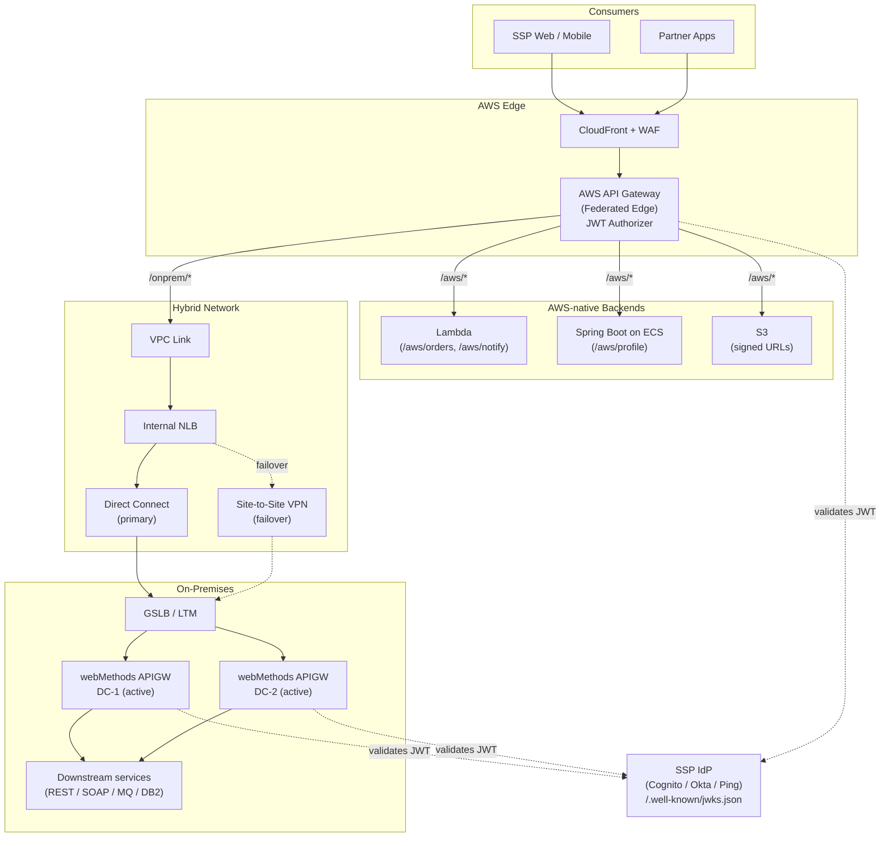

# 01 — System Architecture

## Overview

The Self Service Portal (SSP) is the consumer. It sees **one logical API surface** served by **AWS API Gateway** (the federated edge). Routes that target on-prem systems are proxied via a private network path to **IBM webMethods API Gateway**, which remains the policy enforcement point for everything on-prem.

## Component responsibilities

| Component | Owns |
|---|---|
| **CloudFront + WAF** | TLS termination at edge, OWASP rules, geo / bot mitigation |
| **AWS API Gateway** | Federated edge: JWT auth, consumer rate limits, route classification, request/response transforms |
| **Lambda authorizer** | JWT signature + `iss`/`aud`/`exp`/`scope` validation against SSP IdP JWKS |
| **VPC Link + NLB** | Private bridge from APIGW into the on-prem network |
| **Direct Connect / VPN** | Resilient hybrid connectivity (BGP, sub-minute failover) |
| **webMethods APIGW** | Independent JWT validation, on-prem policy enforcement, protocol mediation (REST↔SOAP/MQ), backend protection |
| **SSP IdP** | OAuth 2.0 / OIDC AS; issues RS256 JWTs; publishes JWKS |

## Design principles

1. **No transitive trust** — webMethods re-validates every JWT.
2. **Single source of truth for API specs** — OpenAPI in Git, published to both gateways by CI.
3. **Independently survivable** — AWS-region loss or DC loss is contained.
4. **Network is also defense** — mTLS on the AWS↔webMethods path, IP allowlisting at webMethods.
5. **Observability is end-to-end** — W3C `traceparent` propagated through both gateways.

## Related diagrams

- [02 — OAuth Flow](02-oauth-flow.md)
- [03 — Routing](03-routing.md)
- [04 — Failover](04-failover.md)
- [05 — Deployment](05-deployment.md)
