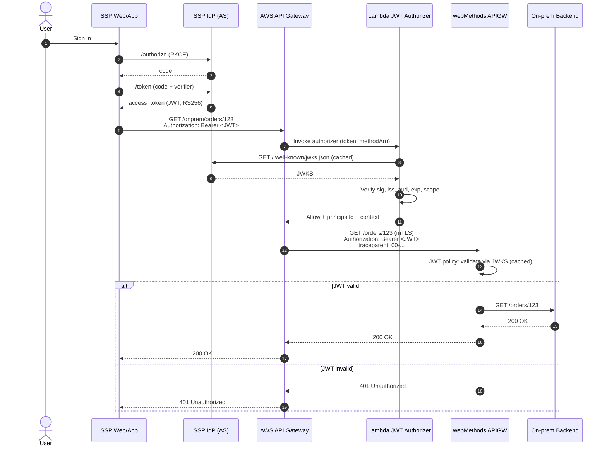
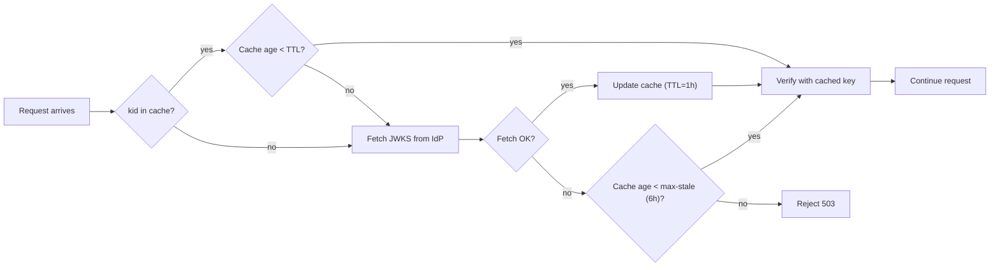

# 02 — Federated OAuth / JWT Flow

## Trust model

- **One Authorization Server**: the SSP IdP. Issues RS256 JWT access tokens.
- **Two Resource Servers**: AWS API Gateway and webMethods API Gateway. Each validates tokens **independently** against the IdP's JWKS endpoint.
- **No transitive trust** — if the JWT is invalid, webMethods rejects it even if AWS APIGW already accepted it.

## Token issuance + dual validation (pass-through JWT)



## Token shape (example)

```json
{
  "iss": "https://idp.ssp.example.com",
  "sub": "user-123",
  "aud": ["ssp-edge", "onprem-orders-api"],
  "scope": "orders:read orders:write profile",
  "azp": "ssp-webapp",
  "exp": 1718812800,
  "iat": 1718809200,
  "nbf": 1718809200,
  "jti": "f4c2...",
  "tenant": "acme"
}
```

- `aud` is a **list** so the same token is accepted by both AWS edge AND the on-prem API.
- `scope` is the authorization unit — enforced per operation in **both** gateways.
- `azp` (authorized party) identifies the client application — useful for per-app rate limits.

## JWKS caching strategy



- **TTL**: 1 hour fresh.
- **Stale-while-revalidate** up to 6 hours if IdP is unreachable — keeps in-flight tokens working during short IdP outages.
- Refresh on `kid` miss (key rotation).
- Alarm on cache age > 6h.

## Why pass-through JWT (v1) and not Token Exchange (v2)

| | Pass-through (chosen) | Token Exchange (RFC 8693) |
|---|---|---|
| Complexity | Low | High — adds an exchange endpoint, separate token lifecycle |
| Audit trail | Single token across hops | Cleaner: separate downstream token per hop |
| Use when | User identity is enough end-to-end | Need impersonation, delegation, or service identity at the downstream |
| Recommended phase | v1 | v2 |

Start with pass-through. Move to token exchange when there's a concrete need (typically: a service-to-service path that must not carry user identity, or when downstream APIs need their own audience without bloating `aud`).

## Failure modes

| Failure | Behavior | Mitigation |
|---|---|---|
| IdP down | No new tokens; in-flight tokens keep working | 15–60 min access token TTL; aggressive JWKS cache |
| JWKS fetch fails | Stale-while-revalidate up to 6h | Alarm + on-call page after 6h |
| Token expired mid-request | 401 from either gateway | SSP refresh token flow + transparent retry |
| Clock skew | Bogus `exp`/`nbf` rejections | 60s leeway in validators; enforce NTP on webMethods |
| Key rotation | `kid` miss | Force JWKS refresh on cache miss |
