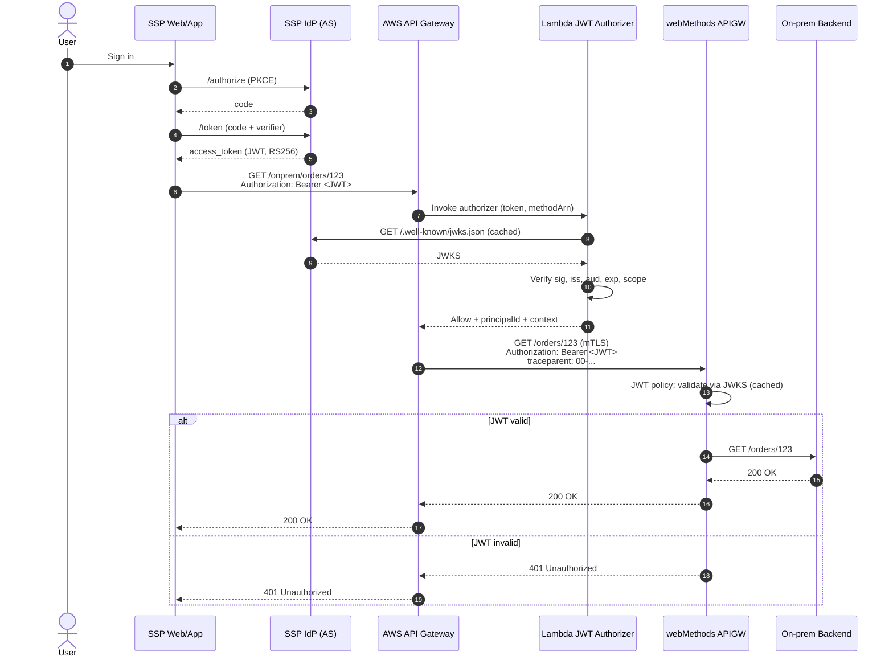
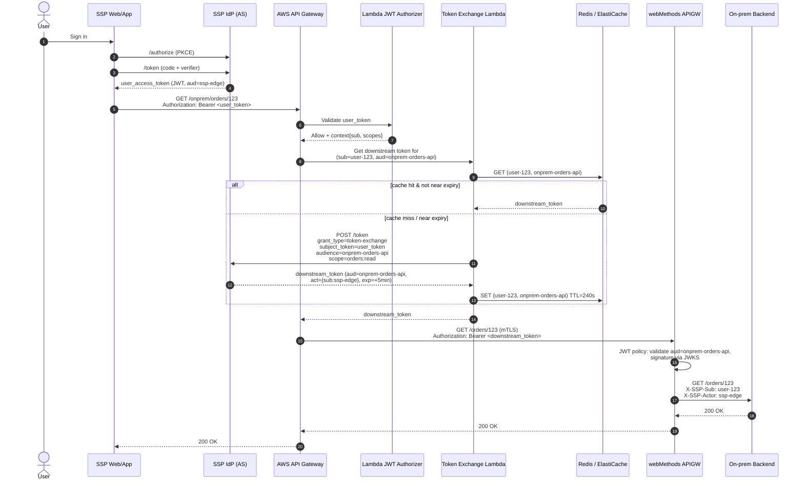
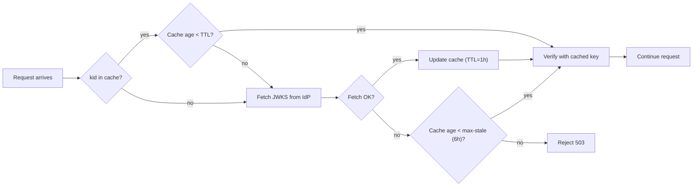

# 02 — Federated OAuth / JWT Flow

Two viable patterns for federating OAuth across AWS API Gateway and IBM webMethods API Gateway (10.15). Both are valid — the choice is about who needs to know about whom downstream.

| | [Option 1 — Pass-through JWT](#option-1--pass-through-jwt-v1-default) | [Option 2 — Token Exchange (RFC 8693)](#option-2--token-exchange-rfc-8693) |
|---|---|---|
| Token presented to webMethods | **Same** JWT the user got from the IdP | **Different** JWT minted for the downstream audience |
| Audience model | Multi-`aud` (`["ssp-edge","onprem-orders-api"]`) | Per-API `aud` (`"onprem-orders-api"` only) |
| Identity on the wire | User identity end-to-end | User identity + actor claim (`act` = SSP edge) |
| Extra latency | None | One IdP call per exchange (cacheable) |
| Recommended phase | **v1** | v2 / where security boundaries demand it |

---

## Trust model (both options)

- **One Authorization Server**: the SSP IdP. Issues RS256 JWT access tokens.
- **Two Resource Servers**: AWS API Gateway and webMethods API Gateway. Each validates tokens **independently** against the IdP's JWKS endpoint.
- **No transitive trust** — if the JWT is invalid, webMethods rejects it even if AWS APIGW already accepted it.

---

## Option 1 — Pass-through JWT (v1 default)

The simplest federation pattern: the **same** access token the SSP user received from the IdP is forwarded unchanged through AWS APIGW to webMethods. Both gateways validate it independently using the IdP's JWKS.

### When to choose Option 1

- v1 / greenfield rollout — you want OAuth working end-to-end before optimizing.
- The downstream service legitimately needs the **user's** identity (not a service identity).
- You can persuade API teams to register a shared audience like `onprem-orders-api` in the IdP and accept multi-valued `aud`.
- No regulatory boundary forces token isolation between hops.

### Sequence



### Token shape

```json
{
  "iss": "https://idp.ssp.example.com",
  "sub": "user-123",
  "aud": ["ssp-edge", "onprem-orders-api"],
  "scope": "orders:read orders:write profile",
  "azp": "ssp-webapp",
  "exp": 1718812800,
  "iat": 1718809200,
  "nbf": 1718809200,
  "jti": "f4c2...",
  "tenant": "acme"
}
```

`aud` is a **list** so the same token is accepted by both AWS edge AND the on-prem API. `scope` is the authorization unit — enforced per operation in both gateways. `azp` (authorized party) identifies the client application.

### Pros
- **Zero added latency** — no extra IdP round-trip per call.
- **Simplest mental model** — one token, one lifecycle, one audit trail.
- **Easy debugging** — same `jti` traceable end-to-end in logs.

### Cons
- **Audience sprawl.** Every downstream API has to be listed in `aud`. If a malicious or buggy service captures the token, it's valid everywhere in the `aud` list.
- **Scope bundling.** The token carries the full scope set; downstream sees more than it strictly needs.
- **Hard to issue downstream identity.** You can't tell webMethods "this call is on behalf of user X **by** SSP edge" — only "this is user X."
- **Coordinated audience registry.** All teams must agree on `aud` naming conventions in the IdP. Without governance this rots.

---

## Option 2 — Token Exchange (RFC 8693)

The AWS edge exchanges the user's token at the IdP for a **downstream-scoped** token (narrower `aud`, narrower `scope`, shorter TTL, with an `act` claim recording who performed the exchange). Only that downstream token is presented to webMethods.

### When to choose Option 2

- A downstream domain needs **strong audience isolation** (regulatory, multi-tenant data plane, partner integration).
- You want service-identity awareness on the wire (`act` = `ssp-edge`) so webMethods can apply different policies for "user via SSP" vs "user via partner portal."
- You're moving toward zero-trust where every hop mints fresh credentials.
- The downstream API team objects to seeing user tokens with scopes they don't recognize.
- You need **short-lived** downstream tokens (1–5 minute TTL) without forcing the SSP user to re-auth every 5 minutes.

### Architecture: where the exchange happens

Three viable placements; we recommend **#2**.

| | Where | Pros | Cons |
|---|---|---|---|
| 1 | SSP Spring Boot does exchange before calling APIGW | Caller knows audience; simple per-service | Every consumer must implement exchange logic |
| 2 | **AWS APIGW Lambda step (recommended)** | Transparent to SSP; one place to evolve; cache shared | One more Lambda hop; needs caching layer |
| 3 | A dedicated Token-Exchange microservice in front of webMethods | Reusable for non-AWS consumers | Yet another service to operate |

### Sequence



### Token exchange request (to IdP `/token`)

```http
POST /token HTTP/1.1
Host: idp.ssp.example.com
Content-Type: application/x-www-form-urlencoded
Authorization: Basic <client_credentials of ssp-edge>

grant_type=urn:ietf:params:oauth:grant-type:token-exchange
&subject_token=eyJhbGciOiJSUzI1NiIs...   (the user's JWT)
&subject_token_type=urn:ietf:params:oauth:token-type:access_token
&audience=onprem-orders-api
&scope=orders:read
&requested_token_type=urn:ietf:params:oauth:token-type:access_token
```

### Downstream token shape

```json
{
  "iss": "https://idp.ssp.example.com",
  "sub": "user-123",
  "aud": "onprem-orders-api",
  "scope": "orders:read",
  "exp": 1718809500,
  "iat": 1718809200,
  "nbf": 1718809200,
  "jti": "9b1a...",
  "tenant": "acme",
  "act": {
    "sub": "ssp-edge",
    "iss": "https://idp.ssp.example.com"
  },
  "may_act": null
}
```

Key differences vs Option 1:

- `aud` is a **single value** — the target API only.
- `scope` is **narrowed** to what the operation needs (`orders:read`, not the full user grant).
- `exp` is **short** (300s typical) — reduces the blast radius of token leak.
- `act` (RFC 8693 §4.1) records the **actor** (the service that performed the exchange). webMethods and the backend can log/authorize on `act.sub` to differentiate "user via SSP" from "user via partner."
- Original `sub` is preserved — the call is still **on behalf of** the user.

### Caching the exchanged token

| Layer | Where | Why |
|---|---|---|
| Per-request | n/a — fresh each time | Only if your IdP supports unlimited issuance and you don't care about latency. **Don't do this.** |
| In-Lambda LRU | Module global in the Token Exchange Lambda | Cheap, no infra, but lost on cold start and not shared across instances |
| **ElastiCache (Redis), per region** | Shared cache, keyed by `(sub, aud, scope_hash)` | **Recommended.** Sub-ms latency, survives Lambda churn, regionally isolated |
| DynamoDB Global Table | Cross-region durable | Overkill unless you need cross-region token portability |

**Cache key:** SHA-256 of `(user_sub | client_azp | target_aud | sorted_scopes)`.
**Cache value:** the downstream JWT plus the absolute expiry timestamp.
**TTL:** `min(token_exp - now - 30s, 240s)` — never serve a token within 30 seconds of expiry; never cache longer than 4 minutes regardless of token TTL (in case of revocation).

### IdP requirements

- Must implement RFC 8693 Token Exchange grant.
- Must allow `ssp-edge` (the exchange client) to mint tokens for the downstream audiences (`token_exchange_target_audiences` list, vendor-specific config).
- Must populate `act` claim on exchanged tokens.
- Cognito does NOT support RFC 8693 natively — you'd need a Lambda-fronted custom endpoint or move the IdP to Keycloak / Okta / Ping / Auth0 (all support it).

### webMethods 10.15 config delta

Almost no change vs Option 1's `jwt-policy.json`:

```diff
   "validate": {
     "issuer": "https://idp.ssp.example.com",
-    "audience": ["ssp-edge", "onprem-orders-api", "onprem-profile-api"],
+    "audience": ["onprem-orders-api"],   // per-API now; or one policy per audience
     "signature": { "mode": "JWKS", ... }
   }
```

Plus an optional authorization rule that checks the `act.sub` claim and applies different rate limits per actor:

```json
{
  "policy": "Authorize User",
  "rules": [
    { "claim": "act.sub", "equals": "ssp-edge",       "rateLimit": "1200/min" },
    { "claim": "act.sub", "equals": "partner-portal", "rateLimit": "300/min"  }
  ]
}
```

### Pros
- **Strong audience isolation** — leaked downstream token can't be replayed against any other API.
- **Least privilege scopes** at each hop.
- **Short downstream TTL** without forcing user re-auth.
- **Actor awareness** — webMethods and backend logs show who acted on whose behalf.
- Easier security review — each hop has its own auditable credential.

### Cons
- **Latency**: ~30–100ms per exchange. Mitigated by cache (typically >95% hit ratio in steady state).
- **IdP dependency on hot path** — token exchange call into IdP becomes part of every cache miss. IdP HA/scale matters more.
- **Operational complexity**: one more Lambda, a Redis cluster, a cache invalidation story (revocation, sub-claim changes).
- **IdP feature gap**: not all IdPs support RFC 8693 cleanly. Cognito doesn't.
- **Debugging is harder**: two different `jti`s for what looks like one logical call. Tracing via `traceparent` becomes essential, not optional.

---

## Decision matrix

| If… | Choose |
|---|---|
| You're rolling out v1 and want OAuth working end-to-end fast | **Option 1** |
| All downstream APIs are owned by the same team / trust boundary | **Option 1** |
| IdP is Cognito and you don't want to swap it | **Option 1** |
| You're crossing a regulatory / data-classification boundary | **Option 2** |
| Downstream services run in partner DCs or are operated by another vendor | **Option 2** |
| You need different rate limits for "user via SSP" vs "user via partner portal" | **Option 2** |
| Your security team requires <5 min token TTL on internal calls | **Option 2** |
| Mixed: some routes need isolation, most don't | **Both** — Option 1 by default, Option 2 selectively per route via OpenAPI `x-token-exchange: true` |

**The mixed model is the realistic end state for most enterprises.** Start with Option 1, identify the 1–3 sensitive routes that need isolation, and selectively enable Option 2 there. Don't boil the ocean.

---

## JWKS caching strategy (applies to both options)



- **TTL**: 1 hour fresh.
- **Stale-while-revalidate** up to 6 hours if IdP is unreachable — keeps in-flight tokens working during short IdP outages.
- Refresh on `kid` miss (key rotation).
- Alarm on cache age > 6h.

---

## Failure modes

| Failure | Option 1 behavior | Option 2 behavior | Mitigation |
|---|---|---|---|
| IdP `/token` down | No new logins; in-flight tokens valid until exp | No new logins **and** no cache-miss exchanges | Cache hits keep working; alarm > 60s outage |
| IdP `/jwks` down | Stale-while-revalidate up to 6h | Same | Alarm + page after 6h cache age |
| Exchanged token expires mid-flight | n/a | Redis TTL ensures we never serve <30s of life | Refresh ahead of expiry |
| Token exchange returns error | n/a | Surface as 503 with `Retry-After`; circuit-break the exchange call | Resilience4j on the TX Lambda |
| Clock skew | Rejections on `exp`/`nbf` | Same — and short Option 2 TTLs make this worse | NTP everywhere; 60s leeway in validators |
| Revocation | Can't revoke an issued JWT; ride out the TTL | **Same**, but TTL is much shorter (300s) → faster effective revocation | Short TTL on exchanged tokens; deny-list `jti` in Redis if hard revoke needed |
| Cache layer down (Option 2) | n/a | Every call becomes a cache-miss → IdP load spikes 20×+ | Multi-AZ Redis; circuit break to in-Lambda LRU fallback |
| Audience misconfig | Single shared `aud` typo breaks everything everywhere | Per-API audience — typo breaks one API | Treat audience registry as code (reviewed PRs) |
