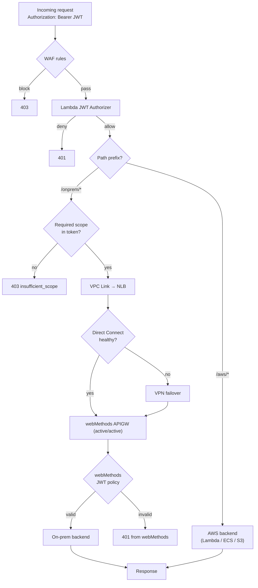

# 03 — Request Routing

## Path convention

| Prefix | Target | Backend |
|---|---|---|
| `/aws/*`     | AWS-native | Lambda / ECS / S3 (per route) |
| `/onprem/*`  | webMethods | Mapped to internal on-prem REST/SOAP services |
| `/health`    | Local | Returned by APIGW Mock Integration |
| `/.well-known/*` | Pass-through | For tooling and discovery |

## Decision flow



## Route classification rules

Routes are declared in OpenAPI specs with an `x-edge` extension. CI uses this to publish to the right gateway(s):

```yaml
paths:
  /onprem/orders/{id}:
    x-edge: onprem        # publish only to AWS APIGW with VPC Link target = webMethods
    get:
      x-required-scope: orders:read
      ...
  /aws/profile:
    x-edge: aws           # publish to AWS APIGW with Lambda target
    get:
      x-required-scope: profile
      ...
  /shared/catalog:
    x-edge: both          # publish to both — AWS APIGW serves cache, webMethods serves origin
```

## Scope enforcement

Both gateways enforce per-operation scopes:

| Gateway | Mechanism |
|---|---|
| AWS APIGW | Lambda Authorizer returns `context.scopes`; integration request maps to backend via VTL or HTTP API JWT authorizer with `authorizationScopes` |
| webMethods | Identify & Access → OAuth2/JWT scope policy attached to the API operation |

## Rate limiting strategy (don't double-throttle)

| Layer | Limit | Purpose |
|---|---|---|
| AWS APIGW Usage Plan | Per API key / per `azp` claim | Consumer-level quota |
| AWS APIGW Method | Per route burst limit | Spike protection |
| webMethods | Per backend operation | **Backend** protection (NOT consumer quota) |

Keep webMethods limits **higher** than AWS APIGW limits for any route reachable via AWS, so the edge always trips first. Otherwise consumers see opaque 429s from the inner gateway with no useful retry-after headers.
