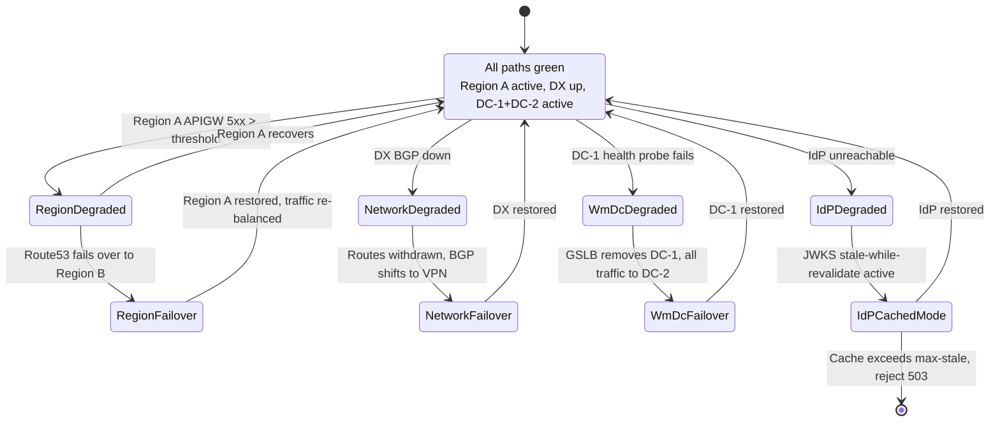
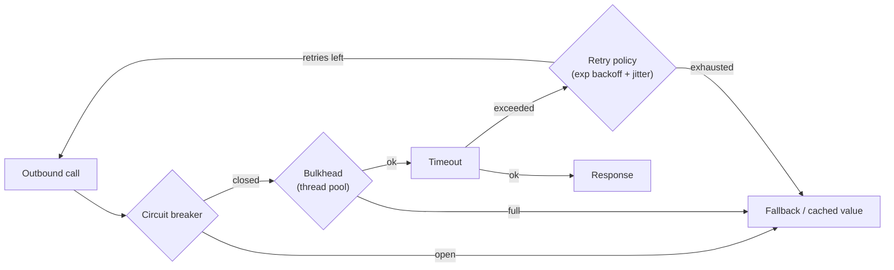

# 04 — Resilience & Failover

## Failover state machine

## Layer-by-layer plan

| Layer | Active/Active | Failover Mechanism | RTO target | Owner |
|---|---|---|---|---|
| CloudFront / WAF | global edge | built-in | n/a | AWS |
| AWS API Gateway | multi-region (A + B) | Route53 health-checked failover | < 60s | Platform |
| Lambda authorizer | multi-AZ per region | native | < 30s | Platform |
| AWS-native backends | multi-AZ per region | ALB / native | < 30s | Service team |
| Direct Connect ↔ on-prem | DX primary + VPN secondary, BGP | route withdrawal | < 60s | Network |
| webMethods APIGW | active/active DC-1+DC-2 | F5 GSLB health probes | < 60s | Integration |
| On-prem backends | per-service HA | varies | per SLA | Service team |
| SSP IdP | multi-region | DNS-based | < 60s | IAM |

## Resilience patterns in code

Implemented in `services/ssp-springboot/`:

Configuration: see `services/ssp-springboot/src/main/resources/application.yml`.

## Idempotency

All write operations carry an `Idempotency-Key` header. Both AWS APIGW (via Lambda) and webMethods (via IS dedupe service) deduplicate within a 24h window. This makes the SSP's retry-on-failover policy safe to enable for non-GETs.

## Async escape hatch

Where the business permits, SSP publishes to **SQS / EventBridge** and an on-prem bridge consumer drains them into MQ on-prem. This decouples SSP UX from on-prem availability windows.

## DR drill cadence

| Drill | Frequency | What we verify |
|---|---|---|
| Region failover (A → B) | quarterly | Route53, data replication, cold path latency |
| DC failover (webMethods DC-1 → DC-2) | quarterly | GSLB removes node, sessions drained |
| DX → VPN cutover | semi-annual | BGP convergence < 60s, throughput degradation acceptable |
| IdP regional failover | semi-annual | JWKS cache survives, no token issuance gap > 60s |
| End-to-end chaos (random component kill) | monthly | Resilience4j fallbacks fire, no user-visible 5xx |
