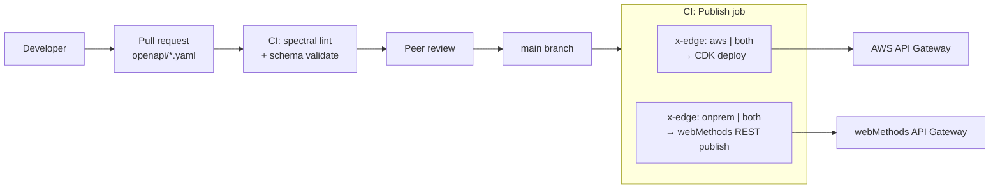
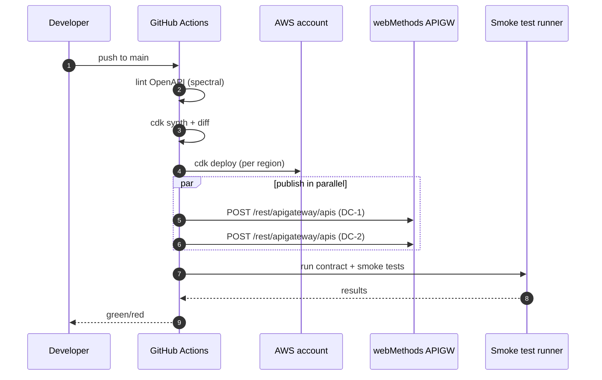

# 05 — Deployment & CI/CD

## Single source of truth

All API contracts are **OpenAPI 3.1** specs in this repo. CI publishes the same spec to both gateways, eliminating the most common federation failure mode (gateways drift apart).

## Pipeline stages

## Branching & promotion

| Branch | Target |
|---|---|
| `feature/*` | sandbox AWS account + webMethods sandbox tenant |
| `main` | dev + staging (auto) |
| tag `v*.*.*` | prod (manual approval gate) |

## Environments

| Env | AWS account | webMethods tenant | IdP realm |
|---|---|---|---|
| dev | `ssp-dev`     | `wm-dev`     | `idp-dev` |
| stg | `ssp-stg`     | `wm-stg`     | `idp-stg` |
| prd | `ssp-prd-a`, `ssp-prd-b` | `wm-prd-dc1`, `wm-prd-dc2` | `idp-prd` |

## Rollback

- **AWS APIGW**: CDK retains last 5 deployments per stage; revert with `aws apigateway update-stage --patch-operations op=replace,path=/deploymentId,value=...` (wired into a `rollback.yml` workflow).
- **webMethods**: every publish creates a versioned API; promotion to the consumer-facing alias is a separate step. Rollback = re-point alias.
- **Database/schema**: out of scope here — owned by individual backend teams.

## Secret handling

- AWS: Secrets Manager + IAM-scoped retrieval at runtime.
- webMethods: Secure Store (configured by the platform team — not in this repo).
- CI: GitHub Actions OIDC → AWS IAM role (no long-lived AWS keys); webMethods publish uses a scoped service account via OIDC-issued short-lived token.

## What's NOT in CI

- IdP configuration (clients, scopes) — managed by IAM team in their own pipeline.
- Network changes (DX, VPN, NLB) — owned by network team, change-controlled.
- webMethods platform upgrades — owned by integration platform team.

This separation keeps API delivery fast without forcing API teams through platform-team review queues.
