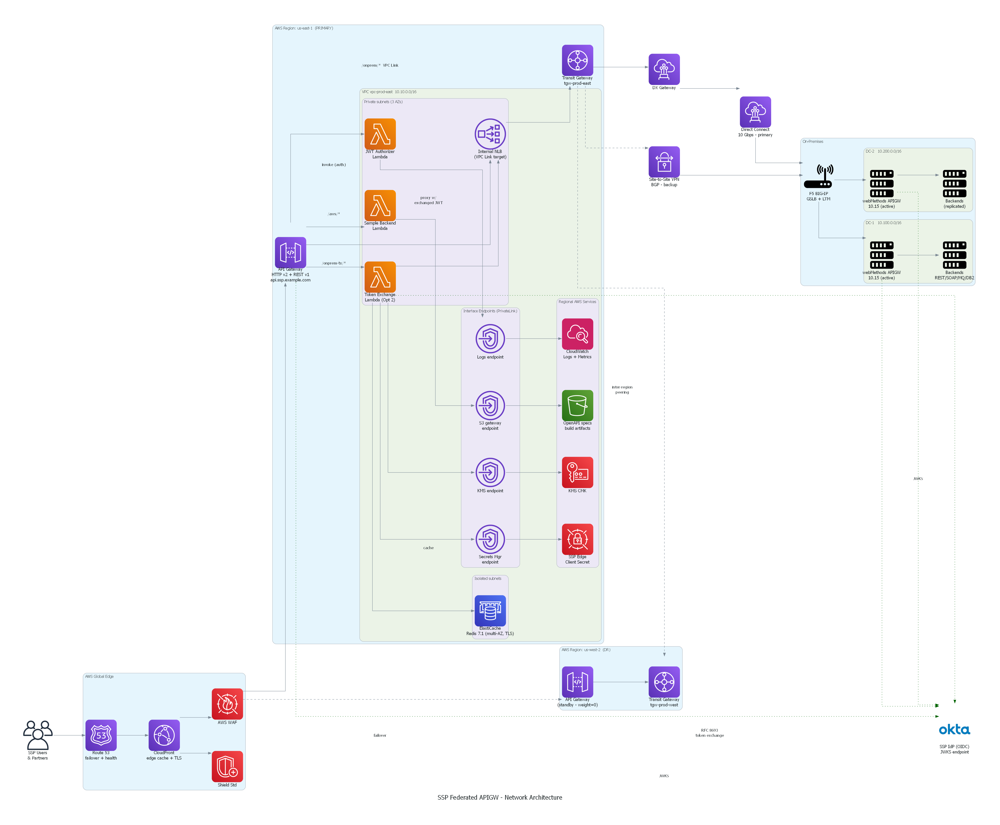
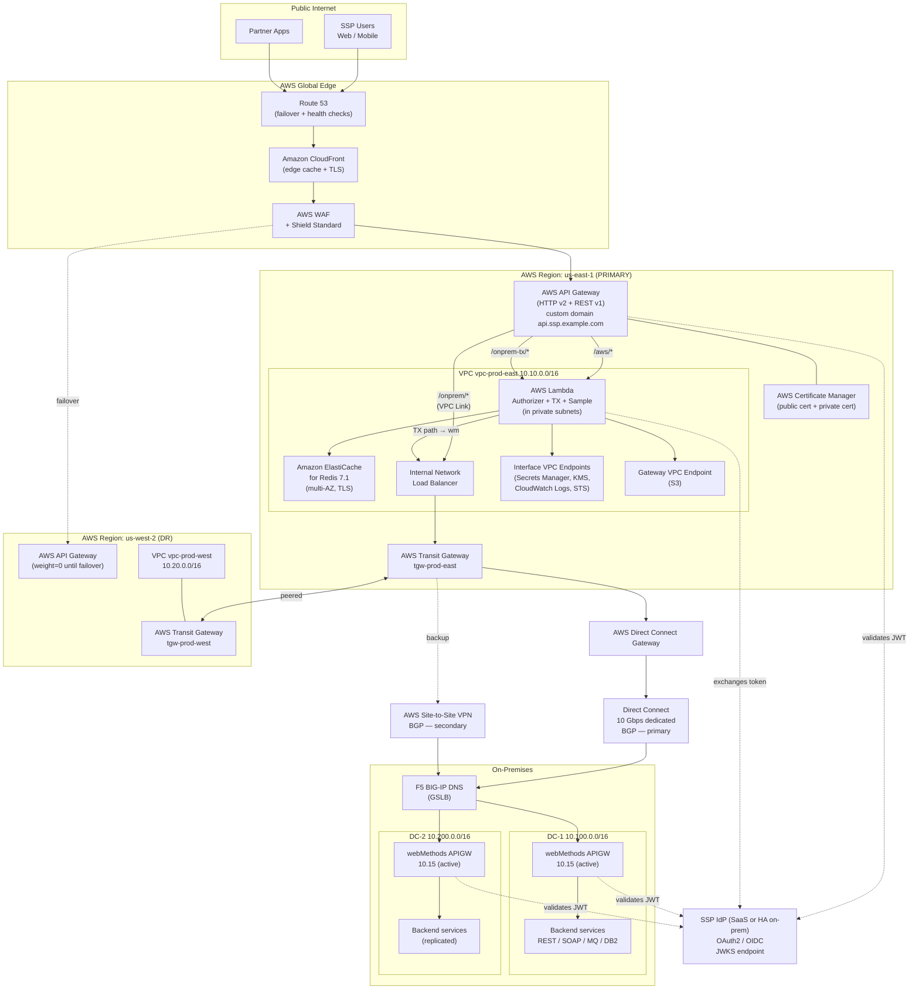
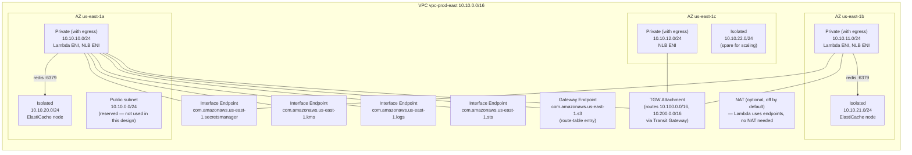
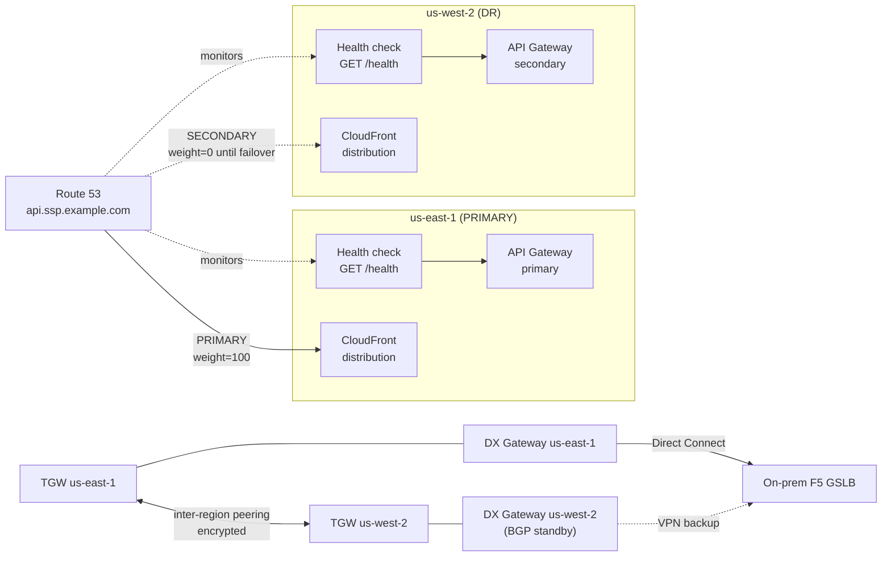
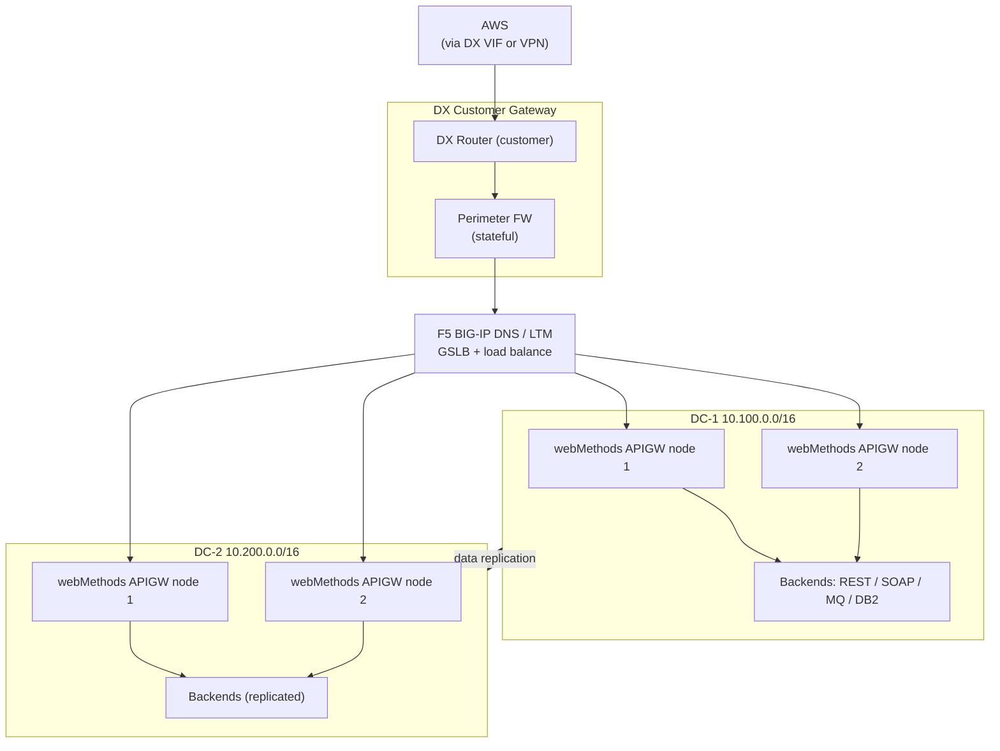
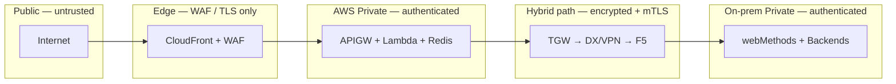

# 06 — Network Architecture (AWS + On-Premises)

End-to-end network design backing the federated APIGW. Covers VPC layout, hybrid connectivity (Direct Connect + VPN), cross-region failover, and the security/port matrix the network team needs to provision.

---

## Rendered architecture (official AWS icons)



> Generated from [`docs/diagrams/network_architecture.py`](diagrams/network_architecture.py) using the [`diagrams`](https://diagrams.mingrammer.com) Python library against the official AWS Architecture Icon set. Regenerate with:
>
> ```powershell
> # one-time
> winget install Graphviz.Graphviz
> python -m pip install --user diagrams
> # whenever the diagram changes
> python docs/diagrams/network_architecture.py
> ```

The Mermaid versions below are kept alongside the PNG so changes are reviewable in diffs (PRs can't diff PNGs meaningfully).

---

## 1. Top-level topology (Mermaid)



---

## 2. VPC layout — primary region zoom



### Subnet plan

| Tier | CIDR (per AZ) | What lives here | NACL stance | Route table |
|---|---|---|---|---|
| Public | 10.10.{0,1,2}.0/24 | **Reserved** — no public ingress in this design | Deny all by default | IGW (unused) |
| Private (with egress) | 10.10.{10,11,12}.0/24 | Lambda ENIs, NLB ENIs, Interface VPC Endpoints | Allow 443 ↔ VPC, 6379 → Data, 443 → on-prem CIDRs | TGW route for 10.100/16, 10.200/16 |
| Isolated | 10.10.{20,21,22}.0/24 | ElastiCache nodes only | Allow 6379 from App tier SG; deny all else | No external route |

### CIDR allocation (full plan)

| Block | Use | Notes |
|---|---|---|
| **10.10.0.0/16** | VPC us-east-1 (primary) | 65k addresses; never exhausted at this design size |
| **10.20.0.0/16** | VPC us-west-2 (DR) | Mirror layout |
| **10.30.0.0/16** | Reserved | Future region / shared services VPC |
| **10.100.0.0/16** | On-prem DC-1 | Owned by network team |
| **10.200.0.0/16** | On-prem DC-2 | Owned by network team |
| **100.64.0.0/16** | Transit Gateway transit CIDR | RFC 6598 — non-routable on public internet |

**Rule:** no CIDR overlap between any VPC and any on-prem DC. Validated by an `aws ec2 describe-transit-gateway-route-tables` check in the network team's CI.

---

## 3. Cross-region & failover



### Failover triggers (in order of detection speed)

| Failure | Detected by | Recovery RTO |
|---|---|---|
| Primary APIGW 5xx > 5% over 60s | Route 53 health check | ~60s (DNS TTL) |
| us-east-1 region down | CloudWatch composite alarm + Route 53 | ~120s |
| Direct Connect BGP down | BGP keepalive (3s × 3) | ~30s — VPN takes over |
| DC-1 down | F5 GSLB probes | ~30s — DC-2 takes over (on-prem-managed) |
| ElastiCache primary down | Multi-AZ automatic failover | ~30–60s |

---

## 4. On-prem network (informational)

Owned by the on-prem network team — included so the AWS-side design aligns with it.



---

## 5. Port / protocol matrix

Use this when filing firewall change tickets.

| From | To | Port | Protocol | Why | Where enforced |
|---|---|---|---|---|---|
| Internet | CloudFront | 443 | HTTPS | User → SSP | AWS WAF |
| CloudFront | API Gateway custom domain | 443 | HTTPS (mTLS optional) | Edge → origin | APIGW + ACM |
| API Gateway | Lambda (Authorizer/TX/Sample) | n/a | invoke | AWS-native call | IAM resource policy |
| API Gateway | NLB (VPC Link) | 443 | HTTPS (mTLS) | Option 1 → webMethods | VPC Link + SG |
| Lambda ENI | ElastiCache Redis | 6379 | TCP (TLS) | Token cache | SG |
| Lambda ENI | VPCE Secrets Manager | 443 | HTTPS | Pull SSP edge client secret | SG + endpoint policy |
| Lambda ENI | VPCE KMS | 443 | HTTPS | Decrypt secret | SG |
| Lambda ENI | VPCE CloudWatch Logs | 443 | HTTPS | Structured logs | SG |
| Lambda ENI | IdP `/token`, `/jwks` | 443 | HTTPS | RFC 8693 exchange + JWKS | NAT or VPCE (if PrivateLink IdP) |
| NLB | TGW → DX → F5 GSLB | 443 | HTTPS (mTLS) | Outbound to on-prem webMethods | TGW route + on-prem FW |
| F5 GSLB | webMethods APIGW nodes | 443 | HTTPS (mTLS) | Health checks + traffic | On-prem |
| webMethods | Backends | varies | REST/SOAP/MQ/JDBC | Service-specific | On-prem |
| Operator laptops | API Gateway admin | n/a | SigV4 over 443 | Operations | IAM |

---

## 6. Security groups (logical model)

| SG | Inbound | Outbound | Attached to |
|---|---|---|---|
| `sg-edge-apigw` | (managed by AWS) | — | API Gateway VPC Link ENI |
| `sg-lambda` | None (Lambda is invoked, not addressed) | 443/anywhere, 6379→`sg-redis`, 443→`sg-vpce-*`, 443→on-prem CIDRs | All in-VPC Lambdas |
| `sg-redis` | 6379 from `sg-lambda` only | — | ElastiCache nodes |
| `sg-nlb-internal` | 443 from `sg-edge-apigw` and `sg-lambda` | — (NLB is L4 pass-through) | Internal NLB ENIs |
| `sg-vpce-secretsmanager` | 443 from `sg-lambda` | — | Interface endpoint ENIs |
| `sg-vpce-kms` | 443 from `sg-lambda` | — | Interface endpoint ENIs |
| `sg-vpce-logs` | 443 from `sg-lambda` | — | Interface endpoint ENIs |

**Principle:** SGs reference other SGs, never CIDR ranges, for intra-VPC traffic. CIDR rules are reserved for on-prem traffic where SG references aren't possible.

---

## 7. VPC Endpoints (PrivateLink)

| Service | Type | Why we keep traffic off the internet |
|---|---|---|
| Secrets Manager | Interface | SSP-edge client secret + DB passwords; PCI/PII concerns |
| KMS | Interface | Decrypt Secrets Manager + ElastiCache transit keys |
| CloudWatch Logs | Interface | Lambda log shipping |
| STS | Interface | Lambda assume-role token refresh |
| S3 | Gateway | Build artifacts, OpenAPI spec storage — gateway endpoint is free |
| Lambda (cross-region invoke) | Interface | Only if cross-region warm-up is wired up — optional |
| (Optional) IdP via PrivateLink | Interface | If the IdP vendor supports PrivateLink (Okta does for the org); otherwise NAT |

**Endpoint policy pattern:** each Interface Endpoint has a least-privilege policy allowing only the specific actions the Lambdas need (e.g., `secretsmanager:GetSecretValue` on a specific ARN), not `*`.

---

## 8. Trust boundaries



Crossing **any** boundary requires:
- TLS in transit (1.2+, prefer 1.3)
- Identity check (JWT at A1, mTLS at H1, JWT again at O1)
- An explicit policy decision (WAF rules, API Gateway resource policies, SGs, NACLs, on-prem FW rules)

---

## 9. Out of scope (intentionally)

These are referenced for context but **owned and provisioned outside this stack**:

- **DX physical circuit + VIF** — Network team, via the AWS DX console / partner.
- **AS numbers and BGP communities** — Network team's NOC documentation.
- **On-prem F5 GSLB config** — On-prem network/integration teams.
- **On-prem firewall rule tickets** — submitted using the port matrix in §5.
- **IdP itself** — IAM team (Cognito user pool / Okta / Ping config).
- **DNS for `api.ssp.example.com`** — Platform DNS team (Route 53 hosted zone delegation).

---

## Related docs

- [01 — System Architecture](01-architecture.md) — logical view (what calls what)
- [02 — OAuth Flow](02-oauth-flow.md) — Options 1 & 2 token flows
- [03 — Routing](03-routing.md) — path classification rules
- [04 — Failover](04-failover.md) — application-layer resilience patterns
